# 03 — Workflows Overview

```mermaid
flowchart LR
  subgraph ACQUIRE
    A1[Website visitor] --> A2[Choose service]
    A2 --> A3[Book consult / Cal.com]
    A3 --> A4[Lead created]
    A4 --> A5[AI score + assign]
    A5 --> A6[Telegram alert Closer]
  end

  subgraph CLOSE
    A6 --> C1[Closer call]
    C1 --> C2{Won?}
    C2 -- Yes --> C3[Generate contract + Stripe link]
    C3 --> C4[Paid → Lead promoted to Client]
  end

  subgraph ONBOARD
    C4 --> O1[Auto-create Project + Phases]
    O1 --> O2[AI generates onboarding form]
    O2 --> O3[Email portal link]
    O3 --> O4[Client fills form, uploads assets]
    O4 --> O5[AI summarises → brief]
    O5 --> O6[Tasks auto-created for UIUX/FE/BE]
  end

  subgraph DELIVER
    O6 --> D1[UIUX design] --> D2[Frontend build]
    D2 --> D3[Backend integration] --> D4[QA]
    D4 --> D5[Draft to client] --> D6{Approved?}
    D6 -- No --> D7[Amendments] --> D5
    D6 -- Yes --> D8[Launch] --> D9[Handover docs]
  end

  subgraph IN_HOUSE_ADS
    H1[Collateral request] --> H2[AI drafts copy + image brief]
    H2 --> H3[Designer finalises] --> H4[Submit to platforms]
    H4 --> H5[Run ads] --> A4
  end

  subgraph CLIENT_ADS
    CA1[Client campaign brief] --> CA2[AI drafts creatives]
    CA2 --> CA3[Client approves via portal]
    CA3 --> CA4[Launch] --> CA5[Daily metrics sync]
    CA5 --> CA6[Auto weekly report]
  end

  subgraph SEO
    S1[Keyword brief] --> S2[AI drafts article]
    S2 --> S3[Editor review] --> S4[Publish] --> S5[Rank tracker sync]
  end

  subgraph CEO_VIEW
    A4 & C4 & O4 & D8 & CA5 --> X[KPI dashboard]
  end
```

## Workflow Index

| # | Workflow | Spec File | Priority |
|---|---|---|---|
| 1 | Onboarding / Info Collection | [workflows/01-onboarding.md](workflows/01-onboarding.md) | **P0 — wedge** |
| 2 | Lead → Close | [workflows/02-lead-to-close.md](workflows/02-lead-to-close.md) | P0 |
| 3 | In-house Ads → Leads | [workflows/03-in-house-ads.md](workflows/03-in-house-ads.md) | P1 |
| 4 | Project Delivery (Website) | [workflows/04-project-delivery.md](workflows/04-project-delivery.md) | P1 |
| 5 | Client Ads Management | [workflows/05-client-ads.md](workflows/05-client-ads.md) | P2 |
| 6 | SEO Content Engine | [workflows/06-seo-content.md](workflows/06-seo-content.md) | P2 |
| 7 | Invoicing & Payment Chasing | [workflows/07-invoicing.md](workflows/07-invoicing.md) | P2 |
| 8 | Client Reporting | [workflows/08-client-reporting.md](workflows/08-client-reporting.md) | P2 |
